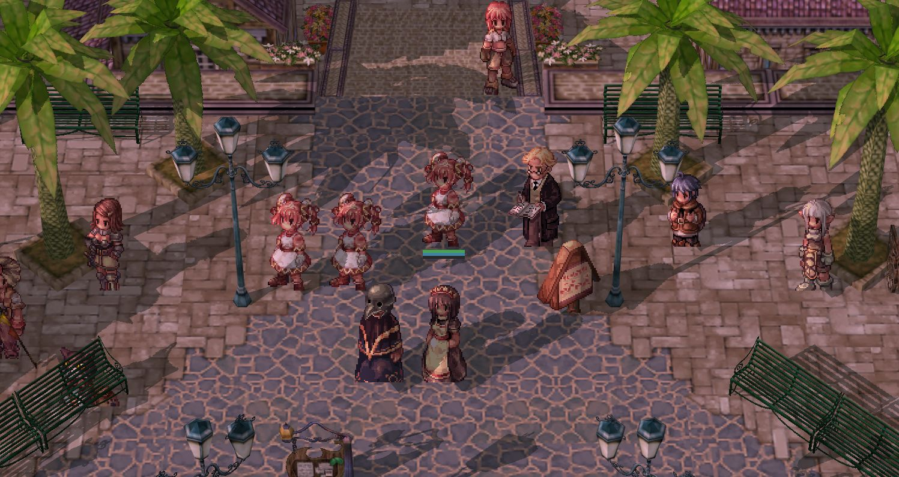
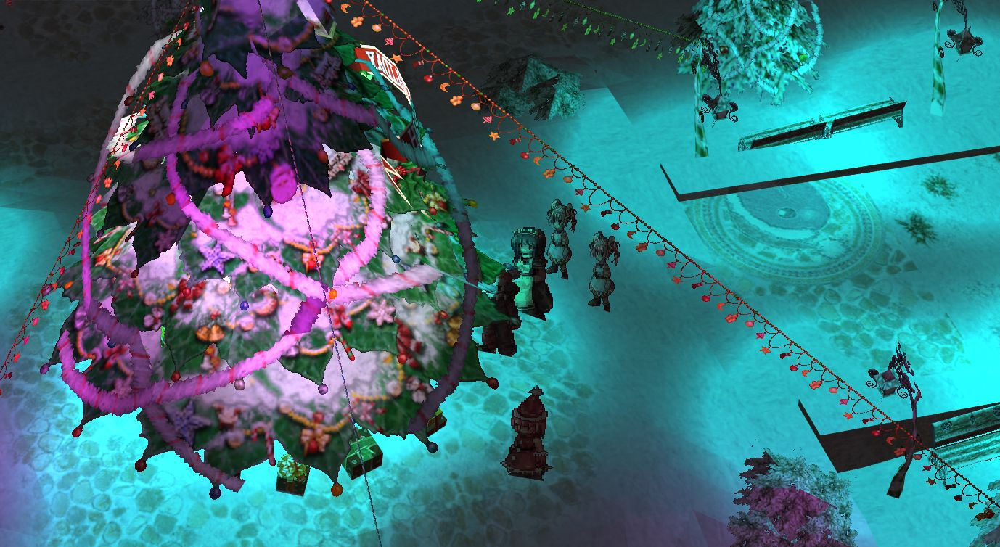

# [Korangar](https://korangar.rs)

Korangar is a Ragnarok Online client written in Rust using Vulkan. It features real-time lighting with drop shadows and a dynamic day-night cycle. It also adds a completely new and very customizable user interface and removes limitations of the official client, such as the fixed aspect ratio.

Here are some pictures of the current progress:

_Geffen_

_Xmas_

