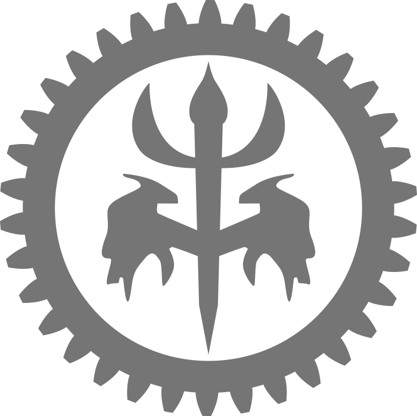
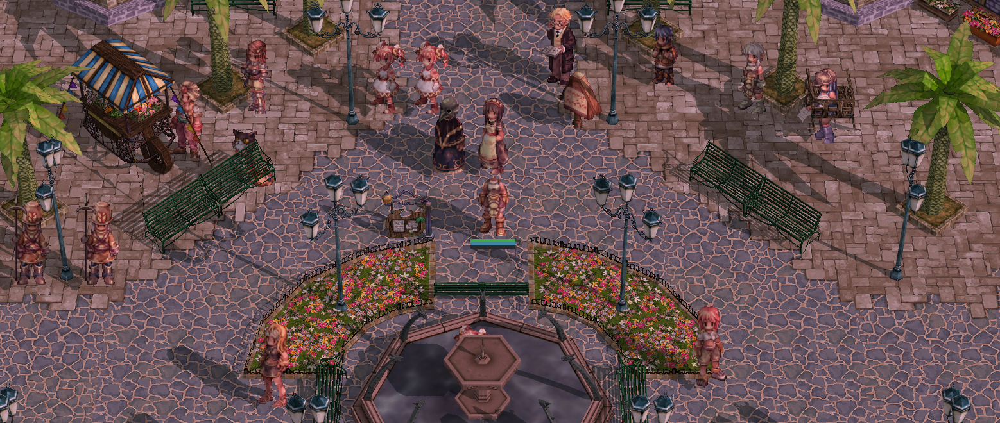

# [Korangar](https://github.com/vE5li/korangar)

Korangar is a Ragnarok Online client written in Rust using Vulkan. It features real-time lighting with drop shadows and a dynamic day-night cycle. It adds a completely new and very customizable user interface and removes limitations of the official client, such as the fixed aspect ratio. It also supports Linux, Windows and MacOS!

##### Screenshot of the current state

#### Running
If you want to try it out for yourself, check out the [Installation page](https://github.com/vE5li/korangar/wiki/Installation) inside the wiki.

#### Updates
I created a [Discord server](https://discord.gg/2CqRZsvKja) where I regularly post updates about the progress of development and answer any questions you might have.

#### Contributing
If you want to contribute to this project, please read [this page](https://github.com/vE5li/korangar/wiki/Contributing).
