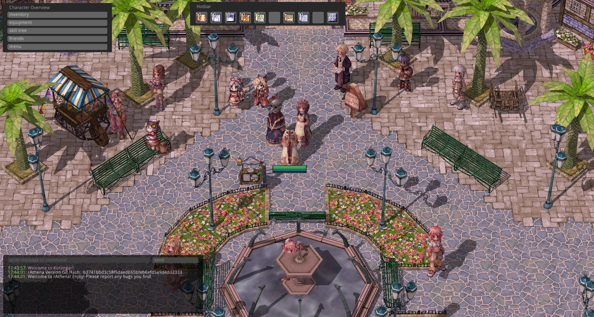

# [Korangar](https://github.com/vE5li/korangar)

Korangar is a next-gen Ragnarok Online client written in Rust. It features real-time lighting with drop shadows. It adds a completely new and very customizable user interface and removes limitations of the official client, such as the fixed aspect ratio. It also supports Linux, Windows and MacOS!

##### Screenshots of the current state

*Geffen in the afternoon*

*Geffen at night*

## 🚀 Running

> [!IMPORTANT]
> Korangar is still very early in development and is anything but feature-complete.

If you want to try it out for yourself, check out the [Installation page](wiki/Installation.md).

## 🔧 Troubleshooting

If you're running into issues while setting up or running Korangar please check the [Troubleshooting page](wiki/Troubleshooting.md). In case your issue is not listed feel free to [create an issue](https://github.com/vE5li/korangar/issues/new) or use the dedicated `support` channel on our [Discord server](https://discord.gg/2CqRZsvKja).

## 🤝 Contributing

This is a very ambitious project and we are always looking for contributors. If you are interested, please read [this page](wiki/Contributing.md).

## 🔥 Updates

There is a dedicated channel for `updates` on our [Discord server](https://discord.gg/2CqRZsvKja). If you want to stay up to date with development or see recent changes, go check it out!

## 📦 Packages

We try to keep the project as modular as possible by splitting the codebase into individual crates. All the crates prefixed with `ragnarok-` are **independent of Korangar and have no dependencies on it**.

We encourage everyone to use these crates for their own Ragnarok Online related projects and contribute back if they want to.
