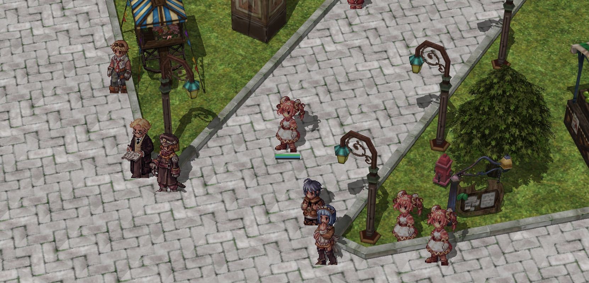

# [Korangar](https://korangar.rs)

Korangar is a Ragnarok Online client written in Rust using Vulkan. It features real-time lighting with drop shadows and a dynamic day-night cycle. It also adds a completely new and very customizable user interface and removes limitations of the official client, such as the fixed aspect ratio.

Here are some pictures of the current progress:

_Geffen_

_Lighthalzen_

# Running

*Disclaimer*: Korangar is still very early in development. There are a ton of issues, and it is everything but feature-complete. It's poorly optimized, so you will need a good device to run it. It also uses some Vulkan features without checking for support first, so i doubt that it will even launch on many older cards.

That being said, you can already get through the tutorial mostly as intended and "walk" around (walk in quotes because there are no proper sprite animations yet, so it's more like sliding).

This project requires Rust nightly to compile. For instructions on how to set up rust and set the correct toolchain, please check out [Rustup](https://rustup.rs/). In order to run the client, you will need to get the `data.grf` and `rdata.grf` from the official kRO client. Move them to this directory and start the client with `cargo run --release`. There are a lot of tools for debugging in this client, to enable them you can run `cargo run --release --features debug`. If you are on Linux, you may also want to enable the features `colors` and `unicode` for some nicer terminal output.

Once the client starts, you will hopefully be asked for a username and a password. A new user can be created by entering your desired username with the suffix `_m` or `_f` and your desired password (*Hint*: remember to remove the `_*` suffix the next time you want to log in to your account).
*Another disclaimer*: Please don't use any of your usual credentials as i will be able to see them in the database. They will also be saved in **plain text** in the client folder if you tick the boxes during login.

After logging in, you will be able to create a new character. If the character creation fails, it could be that you are using invalid characters in the name (e.g. `_`).

I have created a [Discord server](https://discord.gg/2CqRZsvKja) for any problems you may encounter while setting up or running the client. I also plan to post updates about the development on there for anyone interested.

# Contributing

Korangar code should be formatted using [this fork](https://github.com/vE5li/rustfmt) of rustfmt.
